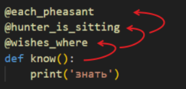

# 4. Functions Decorators & Closures

Категория: Python Core
Статус: В процессе

Декоратор - структурный паттерн проектирования, который позволяет динамически добавлять объектам новую функциональность, оборачивая их в полезные “обертки”.  

В широком смысле, декораторы в Python это вызываемые объекты, которые создаются в помощью замыканий, принимают в качестве аргумента и возвращают дополненный или измененный вызываемый объект. 

В Python реализован синтаксический сахар, позволяющий декорировать функции проще: перед оборачиваемой функцией необходимо указать имя функции-декоратора, добавив перед ним ”@”.

При использовании нескольких декораторов с помощью “@” интерпретатор идет по декораторам снизу вверх.

Как декорировать функцию, принимающую произвольные аргументы? На помощь приходят *args и **kwargs 

При использовании декоратора мы заменяем одну функцию другой. Одним из недостатков этого процесса является то, что он “скрывает” некоторые метаданные. прикрепленные к исходной функции. 

Это делает отладку и работу с интерпретатором Python неудобной и сложной. К счастью, это решение: декоратор functools.wraps, включенный в стандартную библиотеку Python. Он позволяет скопировать потерянные метаданные из недекорированной функции в замыкание декоратора.

Еще немного встроенных декораторов в Python:

1. @property - Превращает метод в свойство. Также используется на сеттеров и геттеров.
2. @classmethod - Позволяет методу работать с классом как с объектом, а не с его экземпляром.

1. @staticmethod - Он не имеет доступа ни к экземпляру класса, ни к самому классу, а просто является обычной функцией, просто организованной внутри класса
2. @contextmanager - Используется для создания пользовательского контекстного менеджера из фукнции.

1. @dataclass - Позволяет автоматически генерировать несколько специальных методов для класса, таких как __**init**__, __**repr**__, __**eq**__, __**lt**__.

**Простой пример декоратора**

**Трехуровневая структура с декоратором**

**Замыкание** - это функция, определяемая и возвращаемая другой функцией, при этом замыкание получает доступ к значениям и объектам в области видимости родительской функции. 

Важной особенностью замыканий является тот факт, что они имеют доступ к самим объектам из области видимости родительской функции, а не к их копиям.

Замыкания способны изменять значения и объекты из области видимости родительской функции, для этого используется оператор nonlocal.

Область видимости переменной определяет контекст переменной, в рамках которого ее можно использовать. Правило LEGB:

1. Local (Локальная) - Переменные внутри функции, доступны в пределах этой функции.
2. Enclosing (Объемлющая) - Переменная внутри функции, охватывающей текущую функцию. 
3. Global (Глобальная) - Переменная, объявленная на верхнем уровне модуля (вне всех функций). Доступна из любого места программы.  
4. Build-in (Встроенная) - Содержит все встроенные функции и имена в Python, такие как len() или print()

Когда используется имя переменной, Python ищет его в следующем порядке:

L → E → G → B → NameError (если переменная не найдена ни в одной из областей).

## `__call__` — декоратор на основе класса

`__call__` делает экземпляр класса вызываемым как функция.

